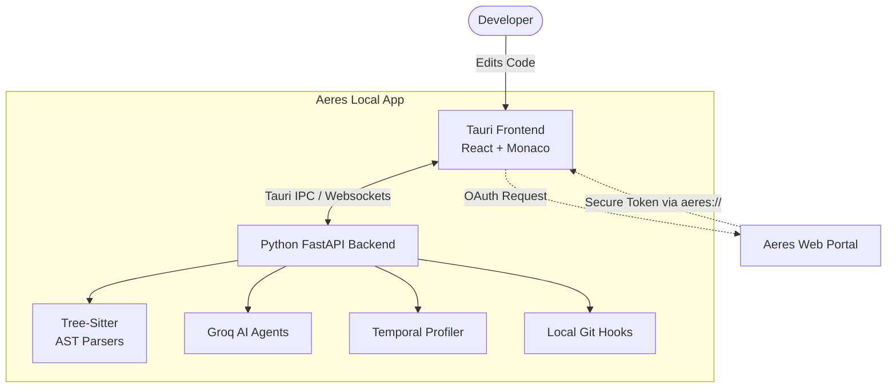

<div align="center">
  
  
  <h1>Aeres IDE</h1>
  <p><b>The Agentic Developer Workspace</b></p>
  <p>A lightning-fast, fully-local Tauri IDE powered by autonomous AI agents, Causal Maps, and Temporal Lens profiling.</p>
  
  <p>
    
    
    
    
  </p>
</div>

---

## What is Aeres IDE?

Aeres is not just a text editor—it is an **agentic developer workspace**. By deeply integrating autonomous LLM agents (powered by Groq) with an ultra-fast local architecture (Rust + Tauri), Aeres allows you to automatically refactor, modernize, trace, and debug massive codebases at the speed of thought.

### Core Features

 **Temporal Lens**
A blazing-fast, language-agnostic AST engine that automatically profiles execution latency, parses outbound calls, and maps inbound workspace references for every function you write.

 **Causal Maps**
Visually trace dependency trees and logic flows across your entire project using beautiful node-based graphs. 

 **Autonomous Mutations**
Streaming AI agents that can read your codebase, plan architectural changes, and autonomously write/refactor code directly into your files using high-speed unified diffs.

 **Native LSP Integration**
Rich autocomplete, hover docs, and instant syntax diagnostics for JavaScript, Python, Rust, Go, C++, and more.

## Architecture Workflow

Aeres IDE utilizes a hybrid architecture designed for raw speed, local filesystem access, and heavy AI inference capabilities.



1. **Frontend (`apps/desktop-client`)**: A fluid, highly responsive React (Vite) interface bundled inside a lightweight Rust/Tauri wrapper. Features integrated Monaco editor panes, xterm.js terminals, and interactive D3 graphs.
2. **AI Engine (`apps/python-backend`)**: A standalone Python FastAPI backend containing the core AI agents, RAG engines, Tree-Sitter AST parsers, and performance profilers.
3. **Web Portal (`apps/web-frontend`)**: The hosted authentication and team-management web portal.

## Getting Started

### Prerequisites
* Node.js (v18+)
* Python 3.10+
* Tauri CLI

### Setup Instructions

1. **Clone the repository**
   ```bash
   git clone https://github.com/LAN-SHLOK/Aeres-IDE.git
   cd Aeres-IDE
   ```

2. **Start the AI Backend**
   ```bash
   cd apps/python-backend
   python -m venv venv
   source venv/Scripts/activate  # On Windows
   pip install -r requirements.txt
   
   # Add your API Keys
   echo "GROQ_API_KEY=your_key_here" > .env
   
   # Start the backend server
   uvicorn app.server:app --reload --port 8008
   ```

3. **Start the Tauri Frontend**
   ```bash
   # Open a new terminal
   cd apps/desktop-client
   npm install
   npm run dev
   ```

## Building for Production (Standalone Executable)

You can compile the entire IDE (including the Python AI engine) into a single standalone `.exe` using the automated build script.

```powershell
# In the root of the repository
.\build_aeres.ps1
```
This script will use PyInstaller to compile the backend into a Tauri sidecar and automatically run the Tauri release pipeline to generate your `.msi` and `.exe` installers.

## Contributing
Contributions, issues, and feature requests are welcome!

---
<div align="center">
  Built by LAN-SHLOK
</div>
