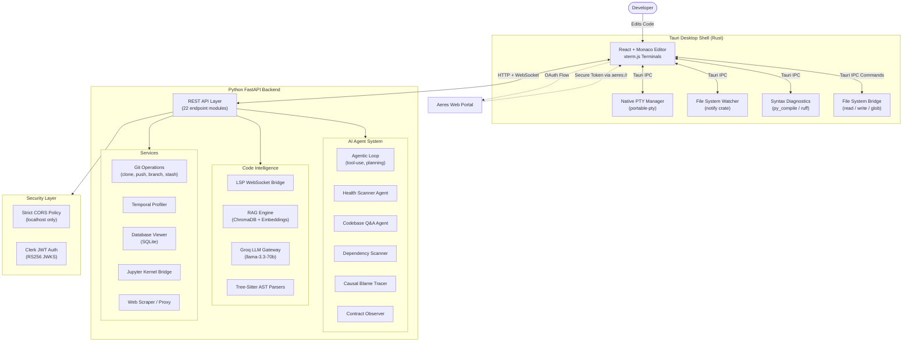

<div align="center">
  
  
  <h1>Aeres IDE</h1>
  <p><b>The Agentic Developer Workspace</b></p>
  <p>A lightning-fast, fully-local Tauri IDE powered by autonomous AI agents, Causal Maps, Temporal Lens profiling, and real-time code intelligence.</p>
  
  <p>
    
    
    
    
    
    
  </p>
</div>

---

## What is Aeres IDE?

Aeres is not just a text editor—it is an **agentic developer workspace**. By deeply integrating autonomous LLM agents (powered by Groq) with an ultra-fast local architecture (Rust + Tauri), Aeres allows you to automatically refactor, modernize, trace, debug, and understand massive codebases at the speed of thought.

Unlike traditional IDEs that bolt on AI as an afterthought, Aeres was built from the ground up with agentic AI at its core—where agents can read, plan, and write code autonomously while you stay in full control.

---

## Core Features

### Temporal Lens
A blazing-fast, language-agnostic profiling engine that automatically tracks execution latency per function. Supports Python (`cProfile`), JavaScript/TypeScript (`--cpu-prof`), and Java. Profiling data persists across runs, building a rolling 20-run history so you can spot performance regressions over time.

### Causal Maps & Architecture Visualizer
Visually trace dependency trees, logic flows, and architecture across your entire project using interactive node-based graphs (D3 + dagre). The **Architecture Visualizer** generates full project blueprints, while **Causal Blame Maps** trace the git blame chain of any function to understand *who changed what and why*.

### Autonomous Mutations (Agentic AI)
Streaming AI agents that can read your codebase, plan architectural changes, and autonomously write/refactor code directly into your files using high-speed unified diffs. Powered by a full **agentic loop** with tool-use: the agent can `read_file`, `edit_file`, `run_command`, `search_codebase`, and even `create_file` on its own.

### Native LSP Integration
Rich autocomplete, hover docs, signature help, and instant syntax diagnostics for JavaScript, TypeScript, Python, Rust, Go, C++, and more—all proxied through a local LSP WebSocket bridge with proper lifecycle management.

### Health Scanner & Dependency Radar
AI-powered project health analysis that scans for deprecated APIs, security vulnerabilities, outdated dependencies, and code smells. The **Dependency Radar** visualizes your dependency tree, checks for CVEs, and offers one-click auto-fix suggestions.

### Contract Snapshots
Runtime behavior observation engine that records function inputs/outputs during execution and uses AI to generate unit tests and behavioral contracts from real runtime data.

### Integrated Debugger (DAP)
Full-featured graphical debugger for Node.js and Python with breakpoints, step-over/step-into/step-out, variable inspection, call stack navigation, and a debug console—all powered by the Debug Adapter Protocol (DAP) over WebSocket.

### Database Viewer
Open and browse `.db` and `.sqlite` files directly inside the IDE with a rich table viewer—no external tools needed.

### Jupyter Notebooks
Run `.ipynb` notebooks with an integrated Jupyter kernel, including cell execution, output rendering, and markdown preview.

### Live Server & Web Preview
One-click Live Server for HTML files (auto-installs via `npx`), with an embedded browser preview panel. Smart project detection: automatically uses `python manage.py runserver` for Django projects or `npm run dev` for Node.js frameworks when you hit Run.

### Command Palette & Quick Open
VS Code-style `Ctrl+Shift+P` command palette with 50+ registered commands, fuzzy file search (`Ctrl+P`), and customizable keybindings.

---

## Full Architecture

Aeres IDE utilizes a **three-layer hybrid architecture** designed for raw speed, local filesystem access, and heavy AI inference capabilities.



### Layer Breakdown

| Layer | Technology | Role |
|-------|-----------|------|
| **Desktop Shell** | Rust + Tauri v2 | Native OS integration, PTY terminals, file watcher, syntax checking, window management |
| **Frontend UI** | React + Vite + Monaco | Code editor, terminal tabs, panels, overlays, D3 visualizations, command palette |
| **AI Backend** | Python + FastAPI + Uvicorn | All AI agents, LSP bridge, RAG engine, git operations, profiling, database viewer |
| **Authentication** | Clerk (JWT RS256) | User authentication with JWKS rotation, dev-mode bypass for local development |
| **Security** | CORS regex whitelist | Blocks drive-by attacks from malicious websites targeting the local backend |

---

## Project Structure

```
Aeres-IDE/
├── apps/
│   ├── desktop-client/          # Tauri + React frontend
│   │   ├── src/
│   │   │   ├── components/
│   │   │   │   ├── Editor/      # Monaco editor, tabs, database viewer, jupyter
│   │   │   │   ├── Panels/      # Health dashboard, dependency radar, RAG chat, temporal lens
│   │   │   │   ├── Sidebar/     # File tree, search, debug, testing, extensions
│   │   │   │   ├── Overlays/    # Command palette, settings, keybindings, onboarding
│   │   │   │   ├── Terminal/    # Terminal tabs with xterm.js
│   │   │   │   ├── Debugger/    # DAP-based debugger UI
│   │   │   │   └── Git/         # Git integration UI
│   │   │   ├── store.js         # Zustand global state
│   │   │   ├── App.jsx          # Main application shell
│   │   │   └── utils/           # Project runner, language detection
│   │   └── src-tauri/
│   │       └── src/lib.rs       # Rust backend: PTY, file ops, diagnostics
│   │
│   ├── python-backend/          # FastAPI AI engine
│   │   ├── app/
│   │   │   ├── agents/          # Agentic loop, health agent, dep scanner, etc.
│   │   │   ├── api/endpoints/   # 22 REST/WebSocket endpoint modules
│   │   │   ├── core/            # Config, security (JWT), file watcher
│   │   │   ├── rag_engine/      # ChromaDB vector store, Groq gateway
│   │   │   └── scrapers/        # Documentation scraper with cron
│   │   └── main.py              # Uvicorn entry point
│   │
│   └── web-frontend/            # Public web portal (auth + landing)
│
├── build_aeres.ps1              # One-click production build script
└── README.md
```

---

## Getting Started

### Prerequisites
* **Node.js** v18+ (with npm)
* **Python** 3.10+
* **Rust & Cargo** (Required for Tauri desktop wrapper. Install via [rustup.rs](https://rustup.rs/))
* A **Groq API Key** (free at [console.groq.com](https://console.groq.com))

### Setup Instructions

1. **Clone the repository**
   ```bash
   git clone https://github.com/LAN-SHLOK/Aeres-IDE.git
   cd Aeres-IDE
   ```

2. **Start the AI Backend**
   ```bash
   cd apps/python-backend
   python -m venv venv
   source venv/Scripts/activate  # On Windows
   pip install -r requirements.txt
   
   # Add your API Keys
   echo "GROQ_API_KEY=your_key_here" > .env
   
   # Start the backend server
   uvicorn app.server:app --reload --port 8008
   ```

3. **Start the Tauri Frontend**
   ```bash
   # Open a new terminal
   cd apps/desktop-client
   npm install
   npm run dev
   ```

---

## Building for Production (Standalone Executable)

You can compile the entire IDE (including the Python AI engine) into a single standalone `.exe` using the automated build script.

```powershell
# In the root of the repository
.\build_aeres.ps1
```
This script uses PyInstaller to compile the backend into a Tauri sidecar and automatically runs the Tauri release pipeline to generate your `.msi` and `.exe` installers.

---

## Engineering Challenges & Solutions

Building a full IDE from scratch surfaces brutal, real-world bugs that no tutorial prepares you for. This section documents the critical issues we encountered during development and the engineering decisions made to solve them—written from a human debugging perspective.

### The Memory Leak That Ate the Browser

**Problem:** After switching between 10-15 files, the IDE would become visibly sluggish. Opening the browser DevTools revealed hundreds of zombie WebSocket connections and duplicated Monaco language providers piling up in memory.

**Root Cause:** Every time the Monaco editor component re-mounted (which happens on every tab switch), the `onDidMount` lifecycle was opening a *brand new* WebSocket to the LSP backend and registering new `CompletionItemProvider`, `HoverProvider`, and `SignatureHelpProvider` instances—without ever disposing the old ones.

**Fix:** We implemented a proper disposal architecture:
- All `monaco.languages.register*()` calls now capture their `IDisposable` return values into an array.
- On editor destruction, every provider is explicitly `.dispose()`d.
- The LSP WebSocket is closed on unmount.
- Pending AI autocomplete debounce timers are cleared to prevent state updates on dead components.

**Lesson:** In React + Monaco, the `onDidMount` callback is *not* the same as a constructor. You must treat it like `useEffect` with a cleanup return.

---

### HTML Tags Refusing to Auto-Close

**Problem:** When typing `<div>` in an HTML file, the editor wouldn't automatically insert `</div>`. This is table-stakes UX for any code editor.

**Root Cause:** Monaco's built-in `autoClosingTags` option is limited and doesn't reliably trigger for HTML. Unlike VS Code (which has a dedicated extension for this), raw Monaco requires custom logic.

**Fix:** We added a `editor.onKeyUp` listener that detects when the user types `>` at the end of an opening tag. It then:
1. Parses the tag name from the line content using regex.
2. Filters out void elements (`br`, `hr`, `img`, `input`, etc.) and self-closing tags.
3. Automatically inserts `</tagName>` and positions the cursor between the tags.

This works for both HTML and JSX files.

---

### Python Errors Showing Yellow Instead of Red

**Problem:** When you write `x = {` (a clear syntax error) in a Python file, the IDE would show a *yellow* warning squiggly line instead of a *red* error squiggly.

**Root Cause:** The Rust backend (`lib.rs`) uses `py_compile` to check Python syntax. The error message parsing was doing a **case-sensitive** string match: `if line.contains("Error")`. But Python's `SyntaxError` message format varies—sometimes the word appears as `error` (lowercase) in the traceback context lines, causing the severity classifier to fall through to the default "Warning" bucket.

**Fix:** Changed the Rust severity detection to use `.to_lowercase()` before matching, ensuring `SyntaxError`, `IndentationError`, and `TabError` are always classified as `Error` severity (red squiggly), not `Warning` (yellow).

**Lesson:** String matching for error classification must always be case-insensitive. Error message formats are never consistent across language runtimes.

---

### Event Listeners Silently Dying

**Problem:** Several command palette actions (like "Go to Bracket", "Next Problem", "Open Live Server") would appear in the palette but do absolutely nothing when clicked.

**Root Cause:** A previous refactoring session had accidentally removed the event handler registrations from the `events` array inside `CodeCanvas.jsx`. The command palette was dispatching events like `aeres:editor-goto-bracket`, but no listener existed to catch them. No error was thrown—the events just vanished silently.

**Fix:** We carefully restored all missing event handler registrations, including `handleNextProblem`, `handlePrevProblem`, `handleFindReferences`, `handleRenameSymbol`, `handleDebugStart/Stop/StepOver/StepInto/StepOut`, and the Live Server handler.

**Lesson:** Always audit your event dispatch-to-handler chain after refactoring. Silent failures in event systems are the hardest bugs to notice because the UI *looks* correct.

---

### Database Files Crashing the Editor

**Problem:** Clicking on a `.db` or `.sqlite` file in the file tree would cause the editor to either show garbled binary garbage or silently crash.

**Root Cause:** The file-open handler in `FileTree.jsx` was reading every file as UTF-8 text and shoving it into a Monaco editor tab—including binary database files. Monaco chokes on binary content.

**Fix:** We added a file extension check in the file-open pipeline. When a `.db`, `.sqlite`, or `.sqlite3` file is detected, it now routes to the dedicated `DatabaseViewer` component (which uses a backend SQLite API) instead of trying to open it as text.

---

### Live Server Crashing on Django Templates

**Problem:** Right-clicking an HTML file inside a Django project's `templates/` folder and selecting "Open with Live Server" would throw a PowerShell error in the terminal.

**Root Cause:** Two issues compounded:
1. The Windows fallback command used `start ""` syntax (cmd.exe style), which is invalid in PowerShell and throws `ParameterBindingValidationException`.
2. The global "Run" button didn't distinguish between a standalone HTML file and a Django template.

**Fix:**
- Changed all Windows fallback commands from `start ""` to `Invoke-Item` (PowerShell-native) across `CodeCanvas.jsx` and `FileTree.jsx`.
- Updated `projectRunner.js` so the Run button checks for project context first—if it detects a Django project, it starts `runserver`; if it's a standalone HTML file, it uses Live Server.
- The explicit "Open with Live Server" context menu always uses `npx live-server` regardless of project type (as the user expects).

---

### CORS Wildcard: The Silent Security Hole

**Problem:** The backend was configured with `allow_origins=["*"]`, meaning *any website on the internet* could make requests to the local IDE backend.

**Risk:** If a developer had the IDE running locally and visited a malicious website, that site's JavaScript could silently:
- Read the developer's source code via `/api/search`
- Execute git commands via `/api/git/commit`
- Write files via the agent's `edit_file` tool
- Exfiltrate API keys via `/api/keys`

All without any authentication (since local dev mode bypasses JWT checks).

**Fix:** Replaced `allow_origins=["*"]` with a strict `allow_origin_regex` that only permits:
- `http://localhost:*` and `http://127.0.0.1:*` (local development)
- `tauri://localhost` (the Tauri desktop app's secure origin)

This is a textbook example of why local-only services still need proper CORS policies.

---

### Health Scanner "Fix Automatically" Button Doing Nothing

**Problem:** The Health Dashboard's "Fix Automatically" button would render but clicking it had zero effect.

**Root Cause:** The `onClick` handler was bound to a function that dispatched an event, but the event listener for that event had been accidentally removed during a previous cleanup pass (same class of bug as the command palette issue above).

**Fix:** Restored the event handler registration and ensured the AI agent pipeline correctly receives the fix request, generates a diff, and applies it to the file.

---

### Tauri Dev Crashing ("cargo metadata" not found)

**Problem:** When running `npm run dev:all`, the backend and frontend start, but the desktop-client crashes with: `failed to run 'cargo metadata' command to get workspace directory: program not found`.

**Root Cause:** Aeres relies on Tauri to compile and run the desktop application window. Tauri requires the Rust toolchain (specifically `cargo`) to be installed and available in the system PATH. 

**Fix:** You must install Rust and Cargo from [rustup.rs](https://rustup.rs/). After installation, restart your terminal or IDE completely so the new PATH variables take effect, and try running `npm run dev:all` again.

---

## Security Model

| Concern | Mitigation |
|---------|-----------|
| **CORS** | Strict regex whitelist—only `localhost`, `127.0.0.1`, and `tauri://localhost` origins allowed |
| **Authentication** | Clerk JWT (RS256) with JWKS auto-rotation. Dev mode gracefully degrades to a local stub user |
| **API Keys** | Stored in user-specific `config.env` (via `platformdirs`), never committed to git. Masked in UI responses |
| **File Access** | All file operations go through Tauri's IPC bridge with OS-native permissions |
| **Terminal** | Native PTY via `portable-pty`—no shell injection possible through the UI |
| **WebSocket** | LSP and DAP WebSocket connections are scoped to `127.0.0.1` only |

---

## Contributing
Contributions, issues, and feature requests are welcome!

---
<div align="center">
  Built by LAN-SHLOK
</div>
