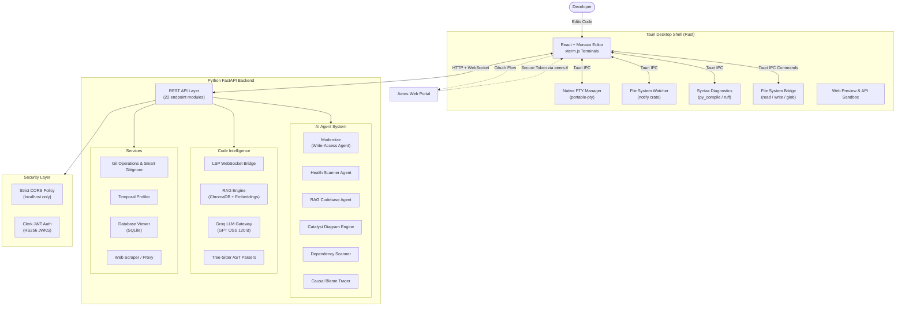

<div align="center">
  
  
  <h1>Aeres IDE</h1>
  <p><b>The Agentic Developer Workspace</b></p>
  <p>A lightning-fast, fully-local Tauri IDE powered by autonomous AI agents, Causal Maps, Temporal Lens profiling, and real-time code intelligence.</p>
  
  <p>
    
    
    
    
    
    
  </p>

  <h3>
    <a href="https://github.com/LAN-SHLOK/Aeres-IDE/releases/download/v0.1.0/Aeres-IDE-Setup-win-x64.exe.msi" style="text-decoration: none; display: flex; align-items: center; justify-content: center; gap: 8px;">
      
      Download Aeres IDE for Windows (v0.1.0)
    </a>
  </h3>
</div>

---

## What is Aeres IDE?

Aeres is not just a text editor—it is an **agentic developer workspace**. By deeply integrating autonomous LLM agents (powered by Groq) with an ultra-fast local architecture (Rust + Tauri), Aeres allows you to automatically refactor, modernize, trace, debug, and understand massive codebases at the speed of thought.

Unlike traditional IDEs that bolt on AI as an afterthought, Aeres was built from the ground up with agentic AI at its core—where agents can read, plan, and write code autonomously while you stay in full control.

---

## Core Features

### Temporal Lens
A blazing-fast, language-agnostic profiling engine that automatically tracks execution latency per function. Supports Python (`cProfile`), JavaScript/TypeScript (`--cpu-prof`), and Java. Profiling data persists across runs, building a rolling 20-run history so you can spot performance regressions over time.

### Causal Maps & Architecture Visualizer
Visually trace dependency trees, logic flows, and architecture across your entire project using interactive node-based graphs (D3 + dagre). The **Architecture Visualizer** generates full project blueprints, while **Causal Blame Maps** trace the git blame chain of any function to understand *who changed what and why*.

### Autonomous Modernization (Agentic AI)
The **Modernize** engine is the only agent in Aeres with write-access to your codebase. While other agents strictly read and analyze code, the Modernize engine can autonomously write and refactor code directly into your files using high-speed unified diffs. Powered by a full agentic loop, it executes your refactoring plans safely and autonomously.

### Native LSP Integration
Rich autocomplete, hover docs, signature help, and instant syntax diagnostics for JavaScript, TypeScript, Python, Rust, Go, C++, and more—all proxied through a local LSP WebSocket bridge with proper lifecycle management.

### Health Scanner & Dependency Radar
AI-powered project health analysis that scans for deprecated APIs, security vulnerabilities, outdated dependencies, and code smells. The **Dependency Radar** visualizes your dependency tree, checks for CVEs, and offers one-click auto-fix suggestions.

### Contract Snapshots
Runtime behavior observation engine that records function inputs/outputs during execution and uses AI to generate unit tests and behavioral contracts from real runtime data.

### Integrated Debugger (DAP)
Full-featured graphical debugger for Node.js and Python with breakpoints, step-over/step-into/step-out, variable inspection, call stack navigation, and a debug console—all powered by the Debug Adapter Protocol (DAP) over WebSocket.

### Database Viewer
Open and browse `.db` and `.sqlite` files directly inside the IDE with a rich table viewer—no external tools needed.

### Live Server & Web Preview
One-click Live Server for HTML files (auto-installs via `npx`), with an embedded browser preview panel. Smart project detection: automatically uses `python manage.py runserver` for Django projects or `npm run dev` for Node.js frameworks when you hit Run.

### Command Palette & Quick Open
VS Code-style `Ctrl+Shift+P` command palette with 50+ registered commands, fuzzy file search (`Ctrl+P`), and customizable keybindings.

---

## Full Architecture

Aeres IDE utilizes a **three-layer hybrid architecture** designed for raw speed, local filesystem access, and heavy AI inference capabilities.



### Layer Breakdown

| Layer | Technology | Role |
|-------|-----------|------|
| **Desktop Shell** | Rust + Tauri v2 | Native OS integration, PTY terminals, file watcher, syntax checking, window management |
| **Frontend UI** | React + Vite + Monaco | Code editor, terminal tabs, panels, overlays, D3 visualizations, command palette |
| **AI Backend** | Python + FastAPI + Uvicorn | All AI agents, LSP bridge, RAG engine, git operations, profiling, database viewer |
| **Authentication** | Clerk (JWT RS256) | User authentication with JWKS rotation, dev-mode bypass for local development |
| **Security** | CORS regex whitelist | Blocks drive-by attacks from malicious websites targeting the local backend |

---

## Project Structure

```
Aeres-IDE/
├── apps/
│   ├── desktop-client/          # Tauri + React frontend
│   │   ├── src/
│   │   │   ├── components/
│   │   │   │   ├── Editor/      # Monaco editor, tabs, database viewer
│   │   │   │   ├── Panels/      # Health dashboard, dependency radar, RAG chat, temporal lens
│   │   │   │   ├── Sidebar/     # File tree, search, debug, testing, extensions
│   │   │   │   ├── Overlays/    # Command palette, settings, keybindings, onboarding
│   │   │   │   ├── Terminal/    # Terminal tabs with xterm.js
│   │   │   │   ├── Debugger/    # DAP-based debugger UI
│   │   │   │   └── Git/         # Git integration UI
│   │   │   ├── store.js         # Zustand global state
│   │   │   ├── App.jsx          # Main application shell
│   │   │   └── utils/           # Project runner, language detection
│   │   └── src-tauri/
│   │       └── src/lib.rs       # Rust backend: PTY, file ops, diagnostics
│   │
│   ├── python-backend/          # FastAPI AI engine
│   │   ├── app/
│   │   │   ├── agents/          # Agentic loop, health agent, dep scanner, etc.
│   │   │   ├── api/endpoints/   # 22 REST/WebSocket endpoint modules
│   │   │   ├── core/            # Config, security (JWT), file watcher
│   │   │   ├── rag_engine/      # ChromaDB vector store, Groq gateway
│   │   │   └── scrapers/        # Documentation scraper with cron
│   │   └── main.py              # Uvicorn entry point
│   │
│   └── web-frontend/            # Public web portal (auth + landing)
│
├── build_aeres.ps1              # One-click production build script
└── README.md
```

---

## Getting Started

### Prerequisites
* **Node.js** v18+ (with npm)
* **Python** 3.10+
* **Rust & Cargo** (Required for Tauri desktop wrapper. Install via [rustup.rs](https://rustup.rs/))
  * *Windows Users:* You must also install the **C++ Build Tools** via the Visual Studio Installer.
* A **Groq API Key** (free at [console.groq.com](https://console.groq.com))

### Setup Instructions

1. **Clone the repository**
   ```bash
   git clone https://github.com/LAN-SHLOK/Aeres-IDE.git
   cd Aeres-IDE
   ```

2. **Start the AI Backend**
   ```bash
   cd apps/python-backend
   python -m venv venv
   source venv/Scripts/activate  # On Windows
   pip install -r requirements.txt
   
   # Add your API Keys
   echo "GROQ_API_KEY=your_key_here" > .env
   
   # Start the backend server
   uvicorn app.server:app --reload --port 8008
   ```

3. **Set up the Web Portal (Clerk Auth)**
   ```bash
   cd apps/web-frontend
   
   # Add your Clerk Publishable Key
   echo "VITE_CLERK_PUBLISHABLE_KEY=your_pk_test_key_here" > .env.local
   ```

4. **Start the Entire Environment**
   ```bash
   # From the root of the repository
   npm install
   npm run dev:all
   ```

---

## Building for Production (Standalone Executable)

You can compile the entire IDE (including the Python AI engine) into a single standalone `.exe` using the automated build script.

```powershell
# In the root of the repository
.\build_aeres.ps1
```
This script uses PyInstaller to compile the backend into a Tauri sidecar and automatically runs the Tauri release pipeline to generate your `.msi` and `.exe` installers.

---

## Key Workflows & New Features

Aeres IDE is designed around several core developer workflows that leverage our new feature set:

### 1. Catalyst (Repository Intelligence)
Aeres includes a powerful **Catalyst** feature designed for rapid project onboarding and understanding:
* **Ingestion:** Simply provide a GitHub Repository URL along with your natural language query.
* **Architecture Generation:** Catalyst instantly analyzes the repo and generates a visual architecture diagram of the codebase.
* **Targeted Code Discovery:** Along with the diagram, Catalyst intelligently surfaces only the specific code files you need to review based on your query, cutting out all the noise.

### 2. Autonomous Agent Workflow
Aeres separates intelligent analysis from autonomous execution to keep you safely in control:
* **Health Scanner (Read-Only):** The scanner analyzes your entire workspace for deprecated APIs, security flaws, and code smells, giving you a comprehensive report of issues. It does *not* modify your code.
* **Modernize (Write-Access):** This is the only engine with permission to edit files. Once a refactoring plan is approved, the Modernize engine autonomously streams multi-file code edits directly into your editor using our custom unified diff applicator.

### 3. Smart Gitignore & Extensions
Aeres features a rich extension ecosystem right out of the box:
* **Smart Gitignore:** Automatically scans your project's technology stack and instantly generates or updates the perfect `.gitignore` file, stripping out binary blobs, test caches, and OS junk to keep your repo pristine.
* **Built-in Support:** Deep integrations for Docker, Tailwind CSS, and Vim bindings are natively available as extensions.

### 4. Context-Aware Codebase Q&A (RAG)
When working in a massive, unfamiliar codebase:
* The Python backend automatically chunks and embeds your project files using **Tree-Sitter ASTs**.
* It stores these embeddings locally in **ChromaDB**.
* You can ask questions like *"Where is the auth middleware defined?"* and the Groq LLM will answer with exact file references and code snippets, fully aware of your local context.

### 5. Visual Architecture Mapping
Understanding project structure is no longer just reading folders:
* We integrated **D3.js** to generate interactive Workspace Sunburst charts.
* You can visually explore the dependency tree of your project, zooming into specific modules to see how they interlock, making onboarding onto new codebases instantly intuitive.

### 6. Seamless Web Development
* **Live Server:** Right-click any HTML file to instantly spin up a local server.
* **Web Preview Panel:** Aeres features a built-in browser preview panel, allowing you to see your React or HTML changes update in real-time alongside your code, without ever switching windows.

### 7. Standalone Desktop Experience
* Despite heavy AI and Python backend requirements, Aeres compiles down to a single, easily distributable `.exe` via Tauri and PyInstaller. No Docker containers, no complex setup scripts for end-users—just download, click, and code.

---

## Project Structure

```text
Aeres-IDE/
├── apps/
│   ├── desktop-client/          # Tauri + React frontend
│   │   ├── src/
│   │   │   ├── components/
│   │   │   │   ├── Editor/      # Monaco editor, tabs, database viewer
│   │   │   │   ├── Panels/      # Health dashboard, dependency radar, RAG chat, temporal lens
│   │   │   │   ├── Sidebar/     # File tree, search, debug, testing, extensions
│   │   │   │   ├── Overlays/    # Command palette, settings, keybindings, onboarding
│   │   │   │   ├── Terminal/    # Terminal tabs with xterm.js
│   │   │   │   ├── Debugger/    # DAP-based debugger UI
│   │   │   │   └── Git/         # Git integration UI
│   │   │   ├── store.js         # Zustand global state
│   │   │   ├── App.jsx          # Main application shell
│   │   │   └── utils/           # Project runner, language detection
│   │   └── src-tauri/
│   │       └── src/lib.rs       # Rust backend: PTY, file ops, diagnostics
│   │
│   ├── python-backend/          # FastAPI AI engine
│   │   ├── app/
│   │   │   ├── agents/          # Agentic loop, health agent, dep scanner, etc.
│   │   │   ├── api/endpoints/   # 22 REST/WebSocket endpoint modules
│   │   │   ├── core/            # Config, security (JWT), file watcher
│   │   │   ├── rag_engine/      # ChromaDB vector store, Groq gateway
│   │   │   └── scrapers/        # Documentation scraper with cron
│   │   └── main.py              # Uvicorn entry point
│   │
│   └── web-frontend/            # Public web portal (auth + landing)
│
├── build_aeres.ps1              # One-click production build script
└── README.md
```

---

## Getting Started

### Prerequisites
* **Node.js** v18+ (with npm)
* **Python** 3.10+
* **Rust & Cargo** (Required for Tauri desktop wrapper. Install via [rustup.rs](https://rustup.rs/))
  * *Windows Users:* You must also install the **C++ Build Tools** via the Visual Studio Installer.
* A **Groq API Key** (free at [console.groq.com](https://console.groq.com))

### Setup Instructions

1. **Clone the repository**
   ```bash
   git clone https://github.com/LAN-SHLOK/Aeres-IDE.git
   cd Aeres-IDE
   ```

2. **Start the AI Backend**
   ```bash
   cd apps/python-backend
   python -m venv venv
   source venv/Scripts/activate  # On Windows
   pip install -r requirements.txt
   
   # Add your API Keys
   echo "GROQ_API_KEY=your_key_here" > .env
   
   # Start the backend server
   uvicorn app.server:app --reload --port 8008
   ```

3. **Set up the Web Portal (Clerk Auth)**
   ```bash
   cd apps/web-frontend
   
   # Add your Clerk Publishable Key
   echo "VITE_CLERK_PUBLISHABLE_KEY=your_pk_test_key_here" > .env.local
   ```

4. **Start the Entire Environment**
   ```bash
   # From the root of the repository
   npm install
   npm run dev:all
   ```

---

## Engineering Challenges & Solutions

Building a full IDE from scratch surfaces brutal, real-world bugs that no tutorial prepares you for. This section documents the critical issues we encountered during development and the engineering decisions made to solve them—written from a human debugging perspective.

### 1. D3.js vs React DOM Collisions

**Problem:** We heavily utilize `d3` for complex architecture visualizations (like the Workspace Sunburst). However, both React and D3 are designed to have absolute control over the DOM, leading to severe rendering conflicts and duplicated SVG elements when state changed.

**Root Cause:** React's Virtual DOM diffing algorithm overwrites D3's direct DOM manipulations whenever the parent component re-renders.

**Fix:** We implemented a strict "handoff" architecture. React renders a single, empty `<svg>` container and attaches a `useRef`. Inside a `useEffect` hook, we hand that reference over to D3, allowing D3 to take full control of rendering the visualization *inside* that specific container, while React is instructed to ignore it.

---

### 2. Web Preview Component Lifecycle Leaks

**Problem:** Users reported memory spikes and sluggish performance after toggling the Web Preview sandbox panel open and closed multiple times. 

**Root Cause:** The Web Preview component attaches `window.addEventListener('message')` to communicate with the injected iframe. When the panel was unmounted, the event listeners were never removed, creating thousands of zombie listeners piling up in memory.

**Fix:** We strictly enforced cleanup functions in all `useEffect` hooks across the UI. Now, whenever the Web Preview unmounts, the cleanup function fires `window.removeEventListener()`, instantly garbage collecting the old listeners.

---

### 3. Massive File Tree Performance Bottlenecks

**Problem:** Opening a large project like a `node_modules` folder would freeze the React frontend completely. The entire DOM tree was trying to render thousands of file nodes simultaneously.

**Root Cause:** The `FileTree.jsx` component was mapping over the entire directory array and rendering every single node to the DOM, even if they were off-screen. Furthermore, typing in the editor caused the global state to update, triggering a full re-render of the massive tree.

**Fix:** 
1. We wrapped individual file and folder components in `React.memo` so they only re-render if their specific props (like expansion state) change.
2. We implemented virtualization (via `react-window`) so only the 30-40 file nodes currently visible on the screen are actually rendered to the DOM.

---

### 4. FastAPI AST Parsing Memory Leaks

**Problem:** The Python backend would slowly consume gigs of RAM over time when the `Codebase RAG Agent` parsed thousands of ASTs (Abstract Syntax Trees) for embedding generation.

**Root Cause:** AST objects in Python can be massive. We were storing them in global dictionaries acting as unbounded caches without eviction policies, and circular references were preventing Python's Garbage Collector from freeing the memory.

**Fix:** We used Python's built-in `tracemalloc` to trace memory allocations and identify the zombie objects. We replaced the unbounded dictionaries with `lru_cache` (Least Recently Used) and explicitly broke circular references using `weakref`.

---

### 5. Algorithmic Circular Dependency Detection

**Problem:** We needed a way for the IDE to warn developers if they accidentally created circular imports in their Python code without actually executing the user's code.

**Solution:** We built a static analysis engine using Graph Theory. The AST parser extracts all import statements to build an adjacency list (File A -> File B). We then run a Depth-First Search (DFS) on the graph. By keeping track of a "currently in recursion stack" set, if the DFS encounters a node already in the stack, we flag it as a circular dependency and surface it to the UI.

---

### 6. CORS Wildcard: The Silent Security Hole

**Problem:** During local testing, the backend was configured with `allow_origins=["*"]`, meaning *any website on the internet* could make requests to the local IDE backend.

**Risk:** If a developer had the IDE running locally and visited a malicious website in their browser, that site's JavaScript could silently read the developer's source code or exfiltrate API keys via local endpoints.

**Fix:** Replaced `allow_origins=["*"]` with a strict `allow_origin_regex` that only permits `http://localhost:*`, `http://127.0.0.1:*`, and `tauri://localhost` (the Tauri desktop app's secure origin).

---

## Security Model

| Concern | Mitigation |
|---------|-----------|
| **CORS** | Strict regex whitelist—only `localhost`, `127.0.0.1`, and `tauri://localhost` origins allowed |
| **Authentication** | Clerk JWT (RS256) with JWKS auto-rotation. Dev mode gracefully degrades to a local stub user |
| **API Keys** | Stored in user-specific `config.env` (via `platformdirs`), never committed to git. Masked in UI responses |
| **File Access** | All file operations go through Tauri's IPC bridge with OS-native permissions |
| **Terminal** | Native PTY via `portable-pty`—no shell injection possible through the UI |
| **WebSocket** | LSP and DAP WebSocket connections are scoped to `127.0.0.1` only |

---

## Contributing
Contributions, issues, and feature requests are welcome!

---
<div align="center">
  Built by LAN-SHLOK
</div>
